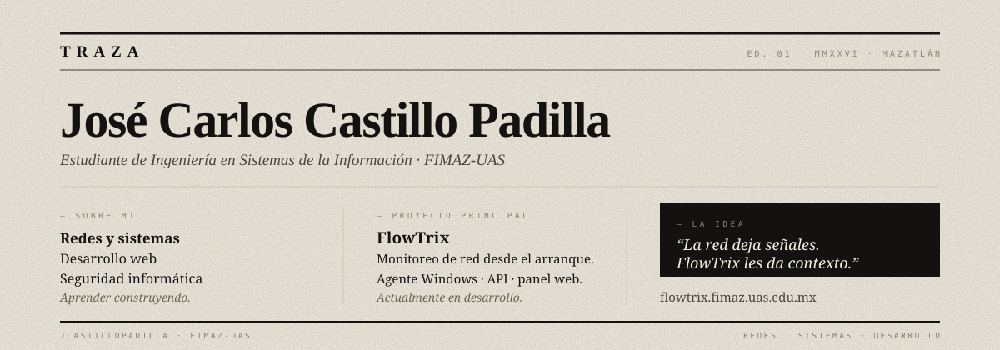

  

  

Soy estudiante de Ingeniería en Sistemas de la Información en FIMAZ-UAS. Me interesan las redes, los sistemas, el desarrollo web y la seguridad informática. Actualmente participo en el desarrollo de **FlowTrix**, una plataforma que observa la actividad de red desde el arranque de los equipos y reúne la información en un panel para consulta y auditoría.

  

### Herramientas y tecnologías

<strong>Lenguajes y web</strong>

  
  
  
  
  
  

<strong>Herramientas y sistemas</strong>

  
  
  
  
  
  

### Contacto

  &nbsp;&nbsp;&nbsp;
  &nbsp;&nbsp;&nbsp;
  &nbsp;&nbsp;&nbsp;
  <a href="https://www.linkedin.com/in/jose-carlos-castillo-padilla-9a46423bb/"><picture><source media="(prefers-color-scheme: dark)" srcset="https://api.iconify.design/mdi/linkedin.svg?color=%23F4EFE4" /></picture></a>&nbsp;&nbsp;&nbsp;
  

  

